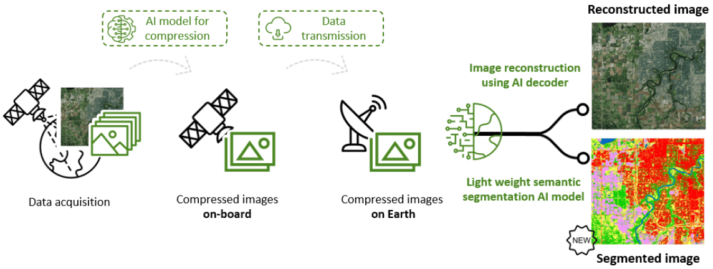

# Intro

Developed by VITO Remote Sensing, CORSA revolutionizes data compression and processing for Earth Observation.
Using advanced deep learning, it efficiently compresses imagery from sensors like Sentinel-1, Sentinel-2 and PRISMA, drastically reducing data volume while maintaining high image fidelity, even at 100x compression rates.

CORSA's compressed features can be directly used to build downstream applications like land use classification change detection and natural disaster mapping and others.

The compression service for Sentinel-2 can also directly be launched from the Terrascope platform in a no-code environment (https://portal.terrascope.be/catalogue/app-details/120).

read more about CORSA:
- VITO blog: https://blog.vito.be/remotesensing/corsa
- Services: https://remotesensing.vito.be/services/corsa

<br>


# Overview
In this repository, we provide a demo for CORSA applied on Sentinel-2 data, implemented on the Terrascope platform.
The CORSA workflow compresses the 10m and 20m resolution bands of Sentinel-2 (10 bands) to compact tif files.


There are various CORSA variants, each differing in size, backbone type, and codebook sizes. These variations influence the reconstruction quality, compression ratio, and performance on downstream applications. The CORSA encoder utilized in this notebook is a lightweight convolutional model with only 5.8 million parameters. It features a two-level codebook with 512 and 128 representative vectors, respectively, achieving a good balance between compression ratio and reconstruction quality. When compressed images are stored as bit arrays, a compression factor of 32.7 is achieved. The reconstruction quality, evaluated on an independent test set, reached a PSNR of 55.8.


In the notebook we:
- Compress large regions of Europe using the CORSA model
- Uncompress (part of this) region to showcase the near-lossless compression
- Use the compressed features in a downstream landcover classification task


# Get started
If you don't already have a Terrascope account, create one for free at https://portal.terrascope.be/, else follow the authentication link at the beginning of the notebook.  <br><br>
If you don't feel like running code you could also run the service interactively through the portal https://portal.terrascope.be/catalogue/app-details/120.
However, the preferred way to interact for the first time with the compression service is through the notebook. In the notebook, you will explore tools to reconstruct the compressed image and use the compressions in a downstream task. These options are not available through the portal. 

**Option 1: Open in your favourite IDE** <br>
1. Clone this repository

2. To create the right environment the easiest option is to use conda ```conda env create -f environment.yml``` and afterwards ```conda  activate corsa_openeo```<br>
Otherwise, it's still possible to install all the dependencies listed in the yml file with pip.

3. Dive into the self-explanatory notebook 'corsa_explore.ipynb'

**Option 2: Open in Colab**
1. Go to https://githubtocolab.com/VITO-RS-CORSA/CORSA-S2-openEO/blob/main/corsa_explore.ipynb. This should open the notebook automatically in Colab.
2. Make sure to set the flag `COLAB=True` in the first cell of the notebook. Dependencies will be handled within the notebook itself.
